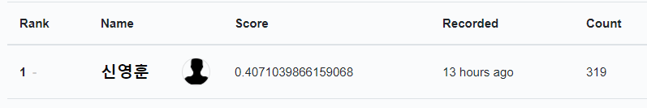

# AI RUSH 2021 2 라운드 후기

## Intro

-   사실상 이번 대회에 참여한 이유가 2라운드에 있었던 추천 문제였던 만큼 재미있게 진행하였다. 추천 관련하여 공부할 때는 사용하는 잘 정돈된 데이터가 거의 정해져있다보니 실제로는 어떤 데이터를 마주하게 될지에 대한 의문이 있었는데 해소할 수 있는 계기가 되었다. 문제 출제도 현업에서 다룰 것과 거의 유사하게 제공해주셨다고 해서 더 흥미롭게 참여하였다.
-   결론부터 말하자면 1번과제 노래 추천의 경우 **1등**,  8번과제 추천을 위한 일반화 임베딩 추출문제의 경우 **2등**으로 마무리하였다. 주력으로 참여한 과제의 경우 1번과제였는데, 제출 기록을 보면 심히 변태스럽다. 거의 2시간에 한 번 수준으로 제출을 하였다. ~~뭐하는 애일까 싶었을 듯~~

## Approach

-   1번 과제의 경우에는 참여자의 점수가 낙타형태를 띄는데, 접근법의 차이로 생각한다. 다른 과제들처럼 단순히 모델만 잘 개발한다고 풀리는 문제가 아니었다.(멘토님도 언급하신 부분) 어떤 데이터를 사용할 것인지 필터링을 해주는 부분이 굉장히 중요했다. 또한 implicit한 데이터에다가 실제 데이터이다 보니 노이즈를 어떻게 제어할지 같은 부분도 중요하게 작용했다. 전체 노래가 아니라 들은 적이 있는 노래에 대해서만 추천을 하는 경우 30%정도 수준은 나왔던 것 같다. 자주 들은 노래순으로 추천하는 경우 37~39 정도는 나왔던 것 같다. 다양성은 떨어질 것이지만, 유저가 실제로 들을만한 곡이라는 점에서는 어느 정도 의미가 있을 것으로 볼 수 있지 않을까
-   본인의 경우 rule 베이스의 추천을 굉장히 강력하게 사용하였다. 실제로 주위에 물어봐도 거의 들었던 곡을 듣는 것을 알 수 있었고, 실제 점수도 이를 따라갔다. 그래서 기본으로 많이 들은 곡을 70% 정도 우선 추천하였다.
    -   여기서 많이 들은 곡을 계산하는 방식이 매우 중요했다. 단순히 카운트 < 30초 이상 중에서만 카운트 < 비율로 계산 순으로 점수를 올릴 수 있었다. 비율로 계산의 경우 트랙 길이 대비 얼마나 들었는지를 계산하여 합한 값이다. 이 방식의 경우 1초만 들은 노이즈들에 대해서 자동적으로 패널티를 줄 수 있는 방식으로 보인다.
-   그다음 rule은 최근 들은 곡과 차트 추천이었다. 최근 들은 곡의 경우 아무래도 청취 기간이 짧다보니 위의 방식으로는 점수가 높지 않을 수 있다. 이런 점을 보완하기 위해서 일부는 최근 들은 곡을 강제로 할당하였다. 그리고 차트 추천방식의 경우 직접적인 차트는 주어지지 않았다. 그래서 다른 사람들이 많이 들은 곡을 임의로 차트화하여 사용하였다. 여기서도 다른 사람이 많이 들은 곡의 정의에 따라서 점수의 변동이 좀 있었는데, 많은 사람이 들은 곡이 가장 좋았다. (한 사람이 여러 번 들어도 한 번으로 카운트)
-   모델의 경우 MF(matrix factorization), FM(factorization machine) 두 가지 방식으로 진행하였다. MF의 경우에도 살짝 변형하여 개선하는 경우 성능이 상당히 나와 대부분의 파라미터 실험을 진행하였고, 마지막에 fine tune 작업에서 xdfm(extreme deep factorization machine)을 중심으로 훈련하였다. 최종적으로는 afm 과 xdfm의 모듈을 결합한 모델(xdafm)이 사용되었다.(심오하게 개발한 모델이 아니다. 간단하게 모듈 2 가지를 합친모델이다. 하나의 모듈로 더 효율적이게 개선할 수 도 있을지 않을 까 싶다.) 

## Outtro

-   역시 실제 서비스는 모델만 가지고 되지 않는 부분이 많았다. 이미지나 자연어 분야는 몰라도 이번 추천 task의 경우 그러하였다. rule 베이스를 강력하게 사용하여 사실 이게 맞는지 싶었는데 멘토님이 그게 중요한 것이 아니라 사용자 경험을 향상시킬 수 있는 것이 중요한 점이라고 이야기해주셨다. 사용자를 위한 서비스를 만들어야지 라는 다짐을 다시 한 번 느낄 수 있었다.
-   1번 과제의 경우 validation 데이터를 따로 만들지 않았다. 최근의 곡들까지 학습하여야 제대로 된 추천을 할 수 있을 것이라고 생각해서였다. 해당 접근은 나쁘지는 않았던 것 같지만 그로 인해서 bandit/강화학습 알고리즘을 사용하지 못했던 것 같아 아쉬움이 남는다.
-   이번 대회가 나의 스타일을 가장 잘 보여준 대회가 아닌 게 싶다. 빠른 프로토타이핑 + 끈기 있는 실험이 가장 잘 보였던 것 같다. 제출을 얼마 안하시면서도 1등을 찍으신 분들을 보면 대단하다는 생각도 들고 때론 자괴감이 들기도 한다. 나는 왜 못올라갈까라는... 그러나 방식을 계속하면 그 상한선과 사이클이 갈수록 개선되지 않을까? 라는 기대를 가지며 후기를 마무리한다.